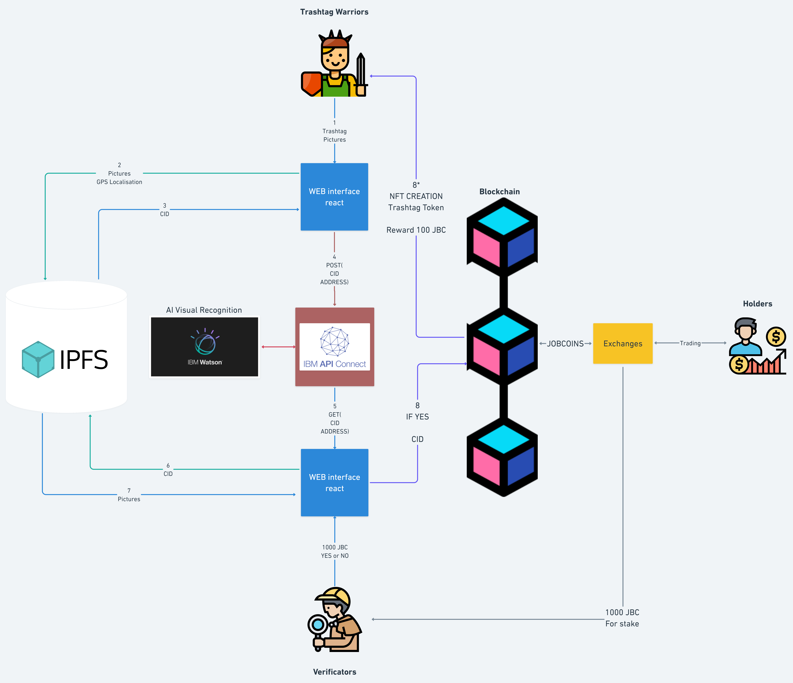

# TrashTag DAPP

## Contents

- [Submission or project name](#submission-or-project-name)
    - [Contents](#contents)
    - [Short description](#short-description)
        - [What's the problem?](#whats-the-problem)
        - [How can technology help?](#how-can-technology-help)
        - [The idea](#the-idea)
    - [Demo video](#demo-video)
    - [The architecture](#the-architecture)
    - [Long description](#long-description)
    - [Project roadmap](#project-roadmap)
    - [Getting started](#getting-started)
    - [Live demo](#live-demo)
    - [Built with](#built-with)
    - [Contributing](#contributing)
    - [Versioning](#versioning)
    - [Authors](#authors)
    - [License](#license)
    - [Acknowledgments](#acknowledgments)

## Short description

### What's the problem?

Wild pollution is a common problem in devlopped and in-developpement countries. This kind of pollution lead to a destruction of natural ecosystem and can be a source of potential desease. Plastic pollution in water supplies is responsible of the onset of desease such as Chloéra and dysenterie. The problem is that is very hard to fight against this kind of pollution because it’s very expensive to paid people to clean natural places.

### How can technology help?

Today the most known cryptocurrency is Bitcoin, where the inflation system work with an electrical heavy consumption. That's mean to create a new bitcoin you need to resolve very complex mathematical problems.
We believe that the blockchain environment is more mature thanks to smartcontracts. So we created the jobcoin. A cryptocurrency where new supply is created each time a Trashtag challenge is done. To remind a Trashtag challenge is an ecological action where people find a place with wild pollution, take a picture, clean it up and take a picture to show the work done. The ambition is to create an economic interests to protect nature.

### The idea

Our world is changing, we learn at school that a majority of job do not exist yet.
We beleive that the blockchain revolution can lead to an new form of employement. An employment where financial speculation can be directly connect to value creation. That's may be possible thanks to new form of organisations which are DAO or Decentralised Autonomous Organisation, the future of ONG.
Blockchain job is basicly task job which are finance by crypto-currencyes.

Like in the delivery industry where the most expensive sector is the last-kilometer shipment. We think if we creat a new form of job to collect wastes no matter where it is. It would permit to local authority to economize money in collect of waste and to reinvest this money to permit the recycling of waste. By this way, we want to privatize the fact of collect wild pollution waste to let local authority the possibility to create recycling center.

Inspired bu the trashtag challenge which was a twitter challenge created in 2019, the concept were to find a place full of waste, take a pictures, clean it up, take a picture again to show the work done, and post it on twitter. We want to bring this idea to a new scale thanks to the blockchain technology. We had the idea of a trashtag Token which are basicaly an Non-fongible token wich are created to represent an trashtag challenge. Futhermore, each time a trashtag warrior

## Demo video

## The architecture

1. The Trashtag warrior connect with his crytpo wallet to the interface and upload trashtag pictures
2. Metadatas (pictures, localisation, date, orientation) are send to a decentralised storage network IPFS (standard for non-fongible token)
3. IPFS return an CID url
4. CID and user blockchain address are post to an API
5. API return CID to the verificator interface
6. Interface extract data from IPFS thanks to the CID
7. Trashtag Pictures are show to the verificators
8. If the Verificator valid th trashtag, 100JBC and a trashtag token will be created for the trashtag warrior.
9. Each time a trashtag is validated, pictures are send to the watson AI to train our model of trash recognition.

## Long description

[More detail is available here](./docs/DESCRIPTION.md)

## Project roadmap

Deployment on Rinkeby tesrnet (July)
Smart contract audit
Launch of Trashtag Dapp on the polygon (or IBM blockchain evm compatible?) mainnet
ICO of jobcoin
Rise a community of Trashtag warrior and verificators
Creation of DAO
Deployment of the decentralised Autonomous Organisation

The project currently does the following things.

- Create Non-fongible token to represent Trashtag Challenge
- Mint 100 JobCoin for initiator of a trashtag challenge
  Visualisation of your Trashtag token (Non-fongible token)
- Staking system for verificator (https://www.coinbase.com/fr/learn/crypto-basics/what-is-staking)*

It's in a free tier IBM Cloud Kubernetes cluster. In the future we plan to run on Red Hat OpenShift, for example.

See below for our proposed schedule on next steps after Call for Code 2021 submission.

## Getting started

###yarn start
Runs the app in the development mode.
Open http://localhost:3000 to view it in the browser.

The page will reload if you make edits.
You will also see any lint errors in the console.

## Live demo

You can find a running system to test at [callforcode.mybluemix.net](http://callforcode.mybluemix.net/).

## Built with

- [IBM Cloudant](https://cloud.ibm.com/catalog?search=cloudant#search_results) - The NoSQL database used
- [IBM Cloud Functions](https://cloud.ibm.com/catalog?search=cloud%20functions#search_results) - The compute platform for handing logic
- [IBM API Connect](https://cloud.ibm.com/catalog?search=api%20connect#search_results) - The web framework used
- [Dropwizard](http://www.dropwizard.io/1.0.2/docs/) - The web framework used
- [Maven](https://maven.apache.org/) - Dependency management
- [ROME](https://rometools.github.io/rome/) - Used to generate RSS Feeds

## Contributing

Please read [CONTRIBUTING.md](CONTRIBUTING.md) for details on our code of conduct, and the process for submitting pull requests to us.

## Versioning

We use [SemVer](http://semver.org/) for versioning. For the versions available, see the [tags on this repository](https://github.com/your/project/tags).

## Authors

- **Billie Thompson** - _Initial work_ - [PurpleBooth](https://github.com/PurpleBooth)

## License

This project is licensed under the Apache 2 License - see the [LICENSE](LICENSE) file for details.

## Acknowledgments

- Based on [Billie Thompson's README template](https://gist.github.com/PurpleBooth/109311bb0361f32d87a2).
- Thanks to all the Blockchain Lab of Garage ISEP, Nicolas Pasquier, Kevin, Eyad, Enzo and Raphaël

